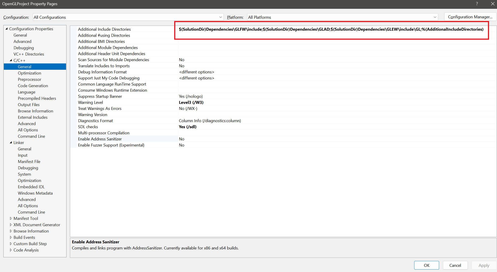
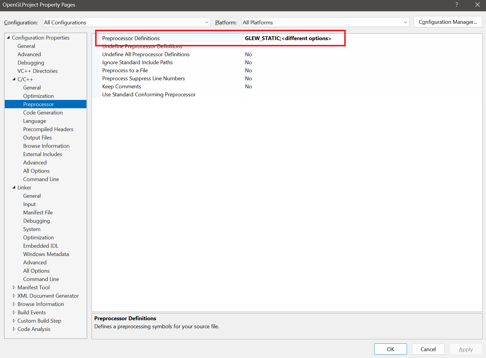
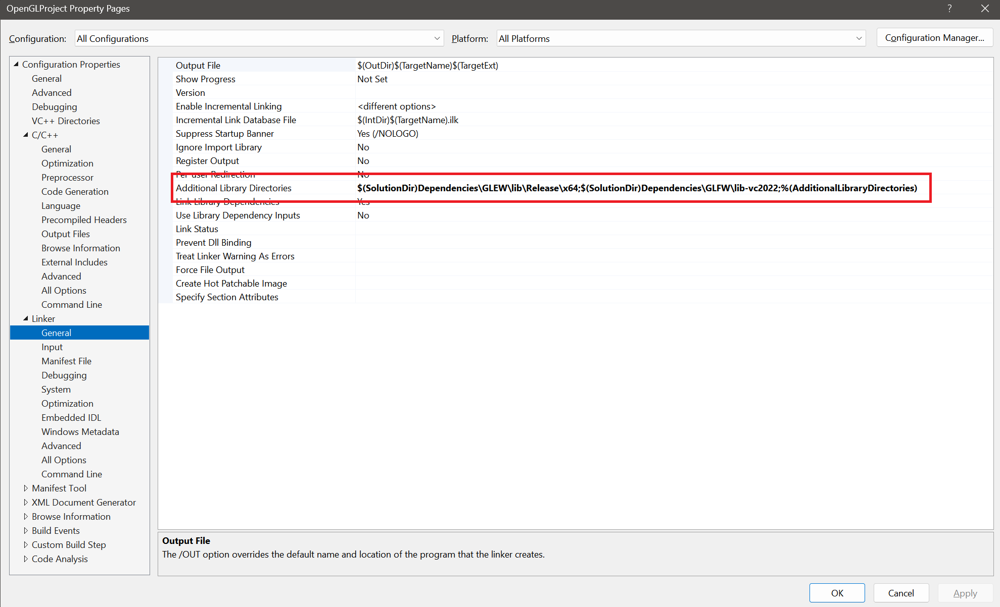
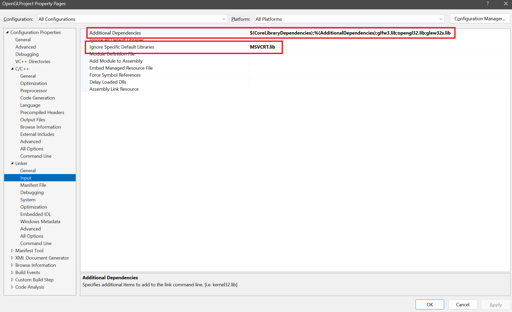

# OpenGL Template

## Overview
This is a simple OpenGL template using GLFW, GLEW, and GLAD. The template provides a basic setup for creating an OpenGL window, rendering a simple triangle, and setting up the necessary dependencies.

## Prerequisites
Ensure you have the following installed before using this template:
- Visual Studio (Recommended: 2022 or later)
- OpenGL-compatible GPU and drivers

## File Structure (Simplified)
```
OpenGLProject/
├── OpenGLProject.sln                # Solution file
├── OpenGLProject.vcxproj            # Project file
├── Dependencies/                     # Contains all necessary libraries
│   ├── GLEW/
│   ├── GLAD/
│   ├── GLFW/
├── Src/
│   ├── main.cpp                      # Main source file
│   ├── glad.c                         # GLAD source file
├── Build/
├── x64/
│   ├── Debug/
│   │   ├── OpenGLProject.exe          # Compiled executable
```

## Setup Instructions

Follow these steps to configure project properties for OpenGLProject in **Microsoft Visual Studio**:  

### 1. Open the Project

1. Open Visual Studio and load `OpenGLProject.sln`.  
2. Navigate to **View** > **Solution Explorer**.  
3. Right-click on **OpenGLProject** in the Solution Explorer.  
4. Click **Properties**.  

### **2. Configure General Settings**  
1. In the **OpenGLProject Property Pages**, select the **Configuration** and **Platform** options as required.  
2. Expand the **C/C++** section in the left panel and click **General**.  
3. Set **Additional Include Directories** to:  
   ```
   $(SolutionDir)Dependencies\GLFW\include;
   $(SolutionDir)Dependencies\GLAD;
   $(SolutionDir)Dependencies\GLEW\include\GL;
   %(AdditionalIncludeDirectories)
   ```  
 - **Screenshot:**
 

### **3. Define Preprocessor Settings**  
1. Navigate to **C/C++ > Preprocessor**.  
2. Add the following to **Preprocessor Definitions**:  
   ```
   GLEW_STATIC; *(Ensure other required definitions are present.)*
   ``` 
 - **Screenshot:**
  

### **4. Configure Linker Settings**  
1. Expand the **Linker** section and click **General**.  
2. Set **Additional Library Directories** to:  
   ```
   $(SolutionDir)Dependencies\GLEW\lib\Release\x64;
   $(SolutionDir)Dependencies\GLFW\lib-vc2022;
   %(AdditionalLibraryDirectories)
   ```  
 - **Screenshot:**
 

1. Click **Input** under Linker and set **Additional Dependencies**:  
   ```
   $(CoreLibraryDependencies);
   %(AdditionalDependencies);
   glfw3.lib;
   opengl32.lib;
   glew32s.lib;
   ```  
2. In the same section, set **Ignore Specific Default Libraries** to:  
   ```
   MSVCRT.lib
   ```  
 - **Screenshot:**
 


### **5. Open and Build the Project**  
1. Navigate to **Source Files** in **Solution Explorer**.  
2. Open `main.cpp`.  
3. Use the following shortcuts to compile and build:  
   - **Ctrl + Shift + B** → Build the project.  
   - **Ctrl + F7** → Compile the project without running.  

*(These shortcuts apply to Windows; for other platforms, refer to respective IDE settings.)*

Once completed, the OpenGLProject should be successfully configured and ready for execution.  

## Features
- Uses **GLFW** for window and input handling.
- Uses **GLEW** to load OpenGL functions.
- Uses **GLAD** for OpenGL function management.
- Renders a simple **color-interpolated triangle**.
- Supports easy modification and extension.

## Modifying the Template
- Modify `main.cpp` to add your own rendering logic.
- The rendering section is marked between:
  ```cpp
  /* START MODIFYING HERE */
  /* END MODIFYING HERE */
  ```
- Add shaders, models, or textures as needed.

## Platform-Specific Notes
### **Windows**
- All dependencies are pre-included; no additional installations are required.

### **Linux & MacOS**
- You may need to manually install GLFW, GLEW, and GLAD using package managers.
- Adjust include and library paths accordingly in project settings.

## License
This template is provided as-is for learning and development purposes.

---
Enjoy coding with OpenGL! 🚀

